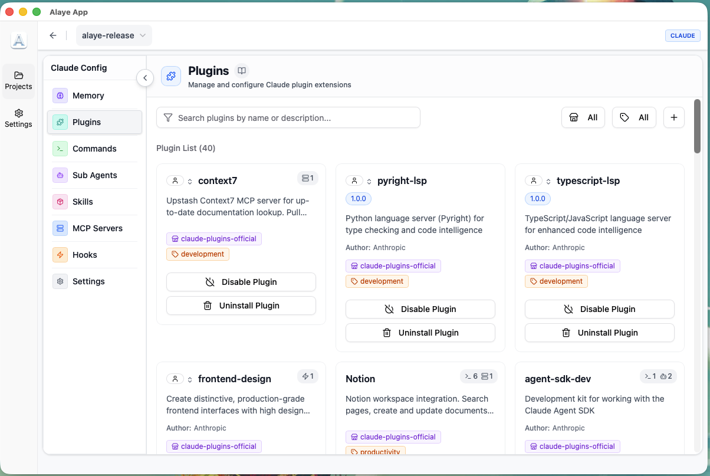

<p align="center">
  
</p>

<p align="center">
  <a href="https://www.producthunt.com/products/alaye-app?embed=true&utm_source=badge-featured&utm_medium=badge&utm_campaign=badge-alaye-app" target="_blank" rel="noopener noreferrer">
    
  </a>
</p>

# Alaye App

[**English**](README.md) | **简体中文**

Alaye App 是一款 AI 工具的桌面端管理助手，旨在为开发者提供统一、便捷的 AI 工具配置与管理体验。

## 项目简介

Alaye App 集成了现代化的用户界面和强大的后端服务，帮助开发者在一个应用中管理多个 AI 工具。

**一期功能（当前版本）**：

- **Claude AI 项目管理**：轻松扫描、配置和管理多个 Claude AI 项目
- **插件与扩展支持**：支持 Claude 插件市场、MCP 服务器配置和 Hooks 管理
- **跨平台运行**：支持 Windows、macOS 和 Linux 操作系统

**未来规划**：持续扩展支持更多 AI 工具和进阶能力

## 技术栈

- **前端**：Next.js 16 + React 19 + TypeScript + Tailwind CSS
- **后端**：Python 3.12 + PyWebView
- **跨平台终端**：pexpect（Unix）/ pywinpty（Windows）

## 环境要求

- **Python**: 3.12 或更高版本
- **Node.js**: 推荐 18 或更高版本
- **操作系统**: Windows 10/11、macOS 11.1+、主流 Linux 发行版

## 快速开始

### 1. 克隆项目

```bash
git clone <repository-url>
cd alaye-app
```

### 2. 安装依赖

推荐使用 `uv` 进行快速安装（会自动安装所有 Python 依赖，包括 Linux 下的 PyQt6）：

```bash
# 安装 uv（如果尚未安装）
pip install uv

# 安装 Python 依赖
uv sync

# 安装前端依赖
cd frontend && npm install && cd ..
```

### 3. 配置环境变量

```bash
cp .env.example .env
```

`.env` 文件中的主要配置项：
- `ALAYE_APP_ENV`: 运行模式（`development`/`export`/`browser`）
- `PORT`: 开发服务器端口（默认 3000）

### 4. 运行应用

**开发模式**（支持前端热重载）：

```bash
# 终端 1：启动前端
cd frontend && npm run dev

# 终端 2：启动后端（确保 .env 中 ALAYE_APP_ENV=development）
python main.py
```

**生产模式**（桌面应用）：

```bash
# 1. 构建前端
cd frontend && npm run build && cd ..

# 2. 启动应用
uv run python main.py
```

**浏览器模式**（Web 测试）：

```bash
# 设置 .env 中 ALAYE_APP_ENV=browser，然后启动
uv run python main.py

# 访问 http://127.0.0.1:8000
```

## 构建独立可执行文件

将应用打包为独立可执行文件，无需安装 Python 环境：

```bash
# 1. 构建前端
cd frontend && npm run build && cd ..

# 2. 执行构建（选择对应平台的脚本）
./scripts/build.sh          # Linux/macOS
scripts\build.bat            # Windows (CMD)
scripts\build.ps1            # Windows (PowerShell)
```

构建完成后，可执行文件位于 `dist/` 目录。

## Roadmap

### ✅ v0.1 - Claude 配置管理（当前版本）



- [x] Claude 项目扫描与管理
- [x] Claude 设置配置（Settings）
- [x] MCP 服务器管理
- [x] Hooks 配置管理
- [x] 插件市场支持
- [x] 多项目支持
- [x] 跨平台桌面应用

### 🔮 v1.0 - 多 AI 工具支持（规划中）
- [ ] 工具扩展: CodeX, Gemini
- [ ] 功能扩展: 统计看板，进阶 AI 能力

## 许可证

本项目采用 MIT 许可证开源。详情请查看项目根目录下的 [LICENSE](LICENSE) 文件。

## 贡献

欢迎提交 Issue 和 Pull Request！

## 支持

如有问题或建议，请通过 GitHub Issues 联系我们。

## 致谢

我们要衷心感谢以下工具和服务对本项目的帮助：

- **[Claude Code](https://claude.com/claude-code)** - 感谢提供强大的 AI 辅助编程能力，极大地加速了我们的开发进程
- **[Doubao](https://www.doubao.com/)** - 感谢生成了项目中使用的精美应用图标
